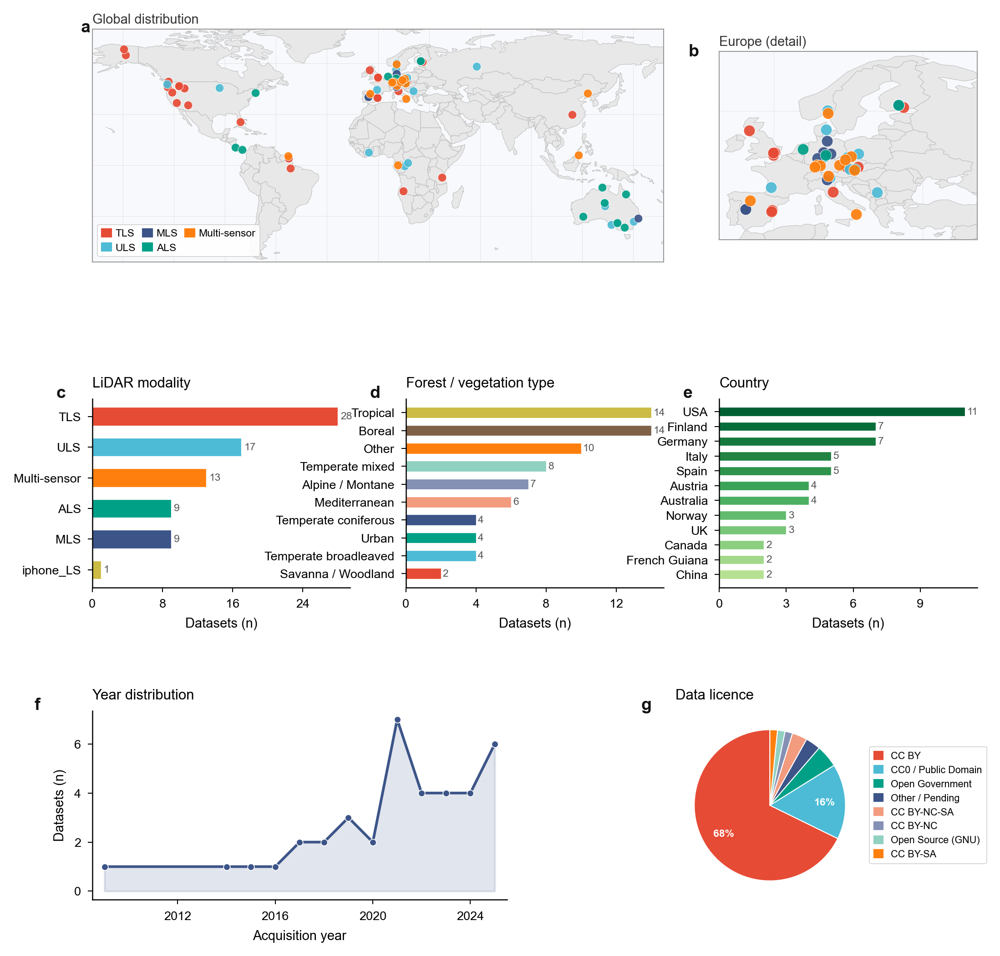

# Forest LiDAR Dataset Dashboard

Summary visualisation of the open-access 3D forest LiDAR dataset catalogue (`SSL_full_metadata.csv`).

## Output figures

### Publication figure (Nature/Science style)



| Format | File | Description |
|--------|------|-------------|
| PNG | [figure_dashboard.png](figure_dashboard.png) | 300 dpi raster, 183 mm wide |
| PDF | [figure_dashboard.pdf](figure_dashboard.pdf) | Fully vector, editable in Illustrator / Inkscape |

**Panels:** (a) global map · (b) Europe detail · (c) LiDAR modality · (d) forest/vegetation type · (e) country ranking · (f) acquisition year · (g) data licence

### Interactive dashboard (Streamlit)

Dark-theme firefly-style web app (`app.py`) with world map, donut charts, country ranking, year timeline and licence breakdown.

```bash
pip install -r requirements.txt
streamlit run app.py
```

## Repository contents

| File / folder | Description |
|---------------|-------------|
| `SSL_full_metadata.csv` | Dataset catalogue (77 entries) |
| `make_figure.py` | Generates `figure_dashboard.png` and `.pdf` |
| `app.py` | Streamlit interactive dashboard |
| `requirements.txt` | Python dependencies |
| `ne_countries/` | Natural Earth 110 m country boundaries (shapefile) |
